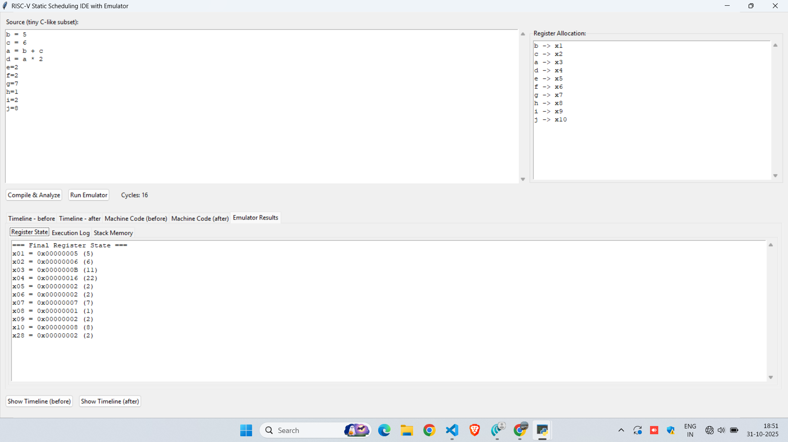
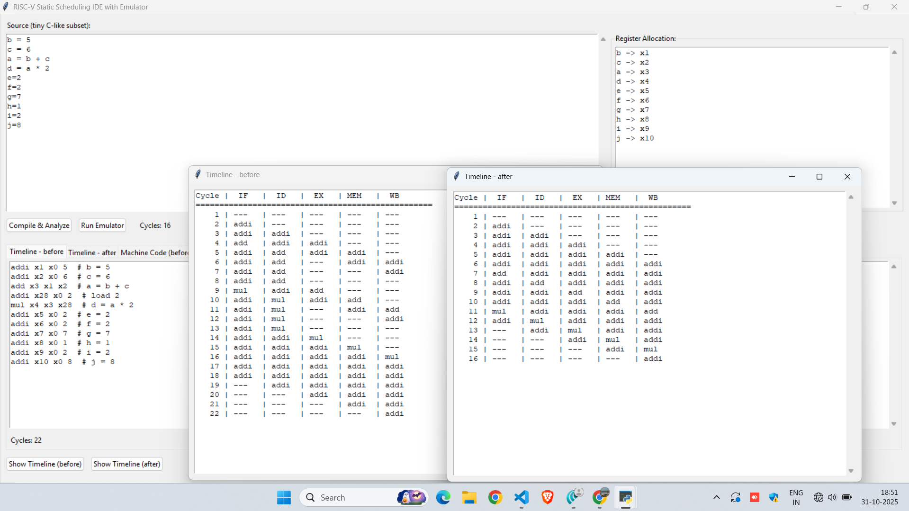

# 🧠 RISC-V Static Scheduling IDE with Emulator

### 🔧 Overview
**RISC-V Static Scheduling IDE** is a compiler and emulator tool that takes a small subset of C-like code as input, converts it to RISC-V assembly, performs **static instruction scheduling**, and visualizes pipeline behavior **before and after scheduling**.  
It allows users to understand **how instruction-level parallelism (ILP)** and **pipeline hazards** affect performance in a RISC-V processor.

---

### 🚀 Features
- ✅ Parses **C-like source code** and generates RISC-V instructions  
- ⚙️ Performs **Static Instruction Scheduling** (compile-time hazard resolution)  
- 🧩 Displays **register allocation** and **final register states**  
- ⏱️ Visualizes **pipeline timelines (before and after scheduling)**  
- 🖥️ Includes an **emulator** to run scheduled instructions and compute register values  
- 📊 Calculates total **cycle count** and performance gain  

---

### 📸 Screenshots

#### 🧩 IDE Interface
Shows source code input, register allocation, and emulator output.



#### ⏱️ Timeline Comparison
Displays instruction flow through pipeline stages **before** and **after** static scheduling.



---

### 🧠 Example Program

Input (C-like source):
```c
b = 5
c = 6
a = b + c
d = a * 2
e = 2
f = 2
g = 7
h = 8
i = 2
j = 8
```

---

### ⚙️ Generated RISC-V Machine Code (Before Scheduling)
```
addi x1, x0, 5     # b = 5
addi x2, x0, 6     # c = 6
add  x3, x1, x2    # a = b + c
addi x28, x0, 2
mul  x4, x3, x28   # d = a * 2
addi x5, x0, 2
addi x6, x0, 2
addi x7, x0, 7
addi x8, x0, 8
addi x9, x0, 2
addi x10, x0, 8
```

---

### 🧩 Register Allocation
| Variable | Register |
|-----------|-----------|
| b | x1 |
| c | x2 |
| a | x3 |
| d | x4 |
| e | x5 |
| f | x6 |
| g | x7 |
| h | x8 |
| i | x9 |
| j | x10 |

---

### 📊 Final Register State
| Register | Value (Decimal) |
|-----------|-----------------|
| x1 | 5 |
| x2 | 6 |
| x3 | 11 |
| x4 | 22 |
| x5 | 2 |
| x6 | 2 |
| x7 | 7 |
| x8 | 8 |
| x9 | 2 |
| x10 | 8 |

---

### 🧮 Timeline Results
| Version | Cycles |
|----------|---------|
| Before Scheduling | 22 cycles |
| After Scheduling | 16 cycles |

⏩ **Performance Gain:** Reduced total cycles from **22 → 16** by static scheduling.

---

### 🧑‍💻 Tech Stack
- **Language:** Python  
- **Architecture:** RISC-V  
- **Pipeline Model:** 5-stage (IF, ID, EX, MEM, WB)  
- **GUI:** Tkinter  

---

### 🧰 How It Works
1. **Compile & Analyze**  
   Parses input C-like code and generates unscheduled RISC-V instructions.
2. **Run Emulator**  
   Executes instructions to compute final register values.
3. **Timeline Comparison**  
   Displays instruction-level pipeline activity before and after scheduling.
4. **Cycle Calculation**  
   Shows performance improvement through reduced stalls and hazards.

---

### 📈 Applications
- Educational tool for **computer architecture and compiler design**  
- Demonstrates **static instruction scheduling** and **hazard resolution**  
- Helps visualize **instruction-level parallelism (ILP)**  


### 👤 Author
**Sowmith**  
